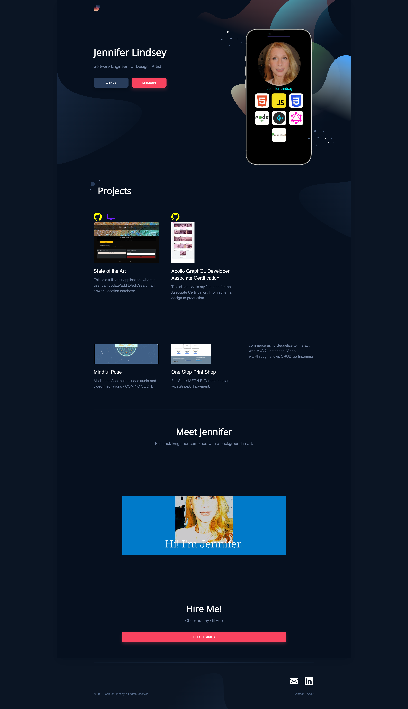

# Portfolio

## **Description**
I created a scrolling single page portfolio to showcase my work 

## **Table of Contents**
* [Installation](#installation)
* [Usage](#usage)
* [Licenses](#licenses)
* [Badges](#Badges)
* [Questions](#questions)

### **Installation**
no installation needed

### **Usage**

**[View my Portfolio](https://jjlindsey.github.io/simple-portfolio/)**

### **Technologies Used:**
 HTML
 CSS
 Javascript

### *Licenses*
MIT license

### *Badges*

### *Questions*
If you have any questions, reach out to me on Git Hub https://github.com/JJLindsey, or send me a message jlindsey010@gmail.com.

©Jennifer Lindsey 2021
